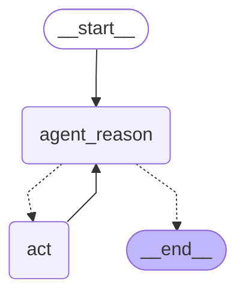

# langgraph-react

ReAct is going to be the reasoning engine for this agent.



### Install Dependencies
```sh
poetry add langchain langgraph langchain-openai langchainhub black isort python-dotenv grandalf langchain_community
```

### Environment
Here is the template for the .env file:
```
OPENAI_API_KEY=<API Key from openai>
TAVILY_API_KEY=<Tavily API Key>
LANGCHAIN_API_KEY=<API Key from langsmith>
LANGCHAIN_TRACING_V2=true
LANGCHAIN_PROJECT=<name that will show up in the langsmith dashboard>
```